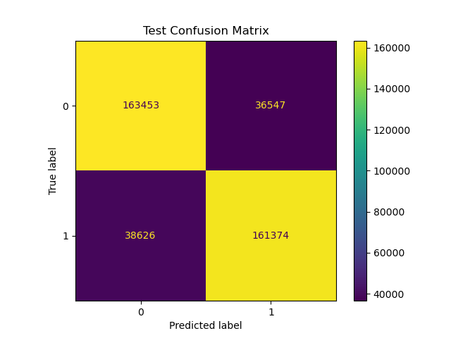

# Week 1 – Sentiment Classification with Traditional ML

## 📌 Objective


## 🧩 Skills & Concepts
- **Text Preprocessing:** tokenization, lemmatization, stopword removal, number replacement 
- **Feature Engineering:** TF-IDF vectorization for sparse text features
- **Modeling:**: Logistic Regression, XGBoost, CatBoost, LightGBM
- **Hyperparameter Tuning:** Optuna integration
- **Evaluation Metrics:** Accuracy, precision, recall, F1, AUROC, AUPRC
- **Experiment Tracking:**: MLFlow for logging metrics, parameters, and artifacts 

## 📦 Dataset
- **Source:** [Penn Treebank – Hugging Face](https://huggingface.co/datasets/penn_treebank)  
- **Size:** 42,068 sentences (80% train / 20% test)  
- **Preprocessing:** Minimal cleaning (dataset already tokenized/normalized). Added `<s>` and `</s>` sentence delimiters and split on whitespace.  

## 📂 Project Structure
- `src/` – Core source code, preprocessing utils, and MLFlow logging functions
- `notebooks/` – Prototyping and data exploration  
- `artifacts/` – Contains metrics, AUROC/AUPRC curves, and confusion matrices for final models on train, val, and test sets
- `best_model/` - Contains metrics and artifacts for the best overall performing model 
- `preprocessing.py` - Script to run the data preprocessing and save the files
- `main.py` – Script to run models and log metrics
- `requirements.txt` – Dependencies  

## ⚙️ Setup
```bash
# Create environment
conda create -n week1 python=3.10 -y
conda activate week1

# Install dependencies
pip install -r requirements.txt
```

## 🚀 How to Run 
```bash 
python3 main.py
```

<!-- ## 🧪 Configuration  -->

## 📊 Results
Below are the performance metrics for each of the best chosen models from the 4 different architectures. The best model was chosen based on validation F1 score since the dataset is perfectly balanced and both recall and precision are important. This best model was an XGBoost model. 

| Model    | Accuracy | Precision | Recall | Specificity | F1    | AUROC  | AUPRC  |
|----------|----------|-----------|--------|-------------|-------|--------|--------|
| LR       | 0.810    | 0.810     | **0.811**  | 0.809       | 0.810 | 0.893  | 0.892  |
| **XGBoost**  | **0.812**    | **0.815**     | 0.807  | **0.817**       | **0.811** | **0.896**  | **0.896**  |
| LightGBM | 0.782    | 0.789     | 0.770  | 0.794       | 0.780 | 0.868  | 0.866  |
| CatBoost | 0.782    | 0.792     | 0.766  | 0.799       | 0.779 | 0.867  | 0.865  |

Below is the confusion matrix of the chosen XGBoost model on the test set. 



**Example Generations**  
_Unigram:_  
> gulf to from came 's `</s>` basis concerns negotiable morgan worried of $ `<s>` as future `<unk>` the have in nine fees credit mr. cents deficit `</s>` in last 's month the `<s>` vietnamese look because union `</s>` of the oil far of energy and customer in being with high

_Bigram:_  
> `<s>` there were sell a new york-based `<unk>` in junk bonds are being acquired `<unk>` within the analyst at N billion of well above $ N one of cocaine consumed at N to do some other of senior subordinated notes sold its spokesman would n't presented his consulting and other

_Trigram:_  
> `<s>` the idea N years old will be able to put it a canadian newspaper publisher said it named its interim location sources say it just has n't yet found a way to go national with pizza which it should be doing more to private investors the refinancing of campeau

## 📌 Key Takeaways
- **Bigrams significantly reduced perplexity** compared to unigrams, showing that adding immediate context improves predictive power.
- **Trigram perplexity increased sharply** without smoothing due to data sparsity — many trigram combinations never appeared in training.
- **Laplace smoothing** reduced trigram perplexity but was still higher than bigrams, highlighting the trade-off between context length and data availability.
- **Fallback models** (using lower-order n-grams when higher-order counts are missing) gave the best perplexity, balancing context with coverage.
- **Language is inherently sparse**, and any model that tries to predict the next word must find clever ways to deal with uncertainty, data sparsity, and variability in expression.
- Generated samples from higher n-grams were more coherent than unigrams but still lacked grammatical structure — a limitation of pure statistical models. Trigram model could formulate simple phrases, like "will be able to", but lack coherence overall. 


## 🧠 Engineering Notes
- Modularized model training, generation, and evaluation for reusability in future language modeling projects.  
- Implemented smoothed probability estimation to handle unseen n-grams.  
- Added fallback perplexity to balance accuracy and coverage.
- Saved results in JSON format. 

## 🗺️ Next Steps
- Experiment with Kneser-Ney smoothing.  
- Compare performance with neural language models (Week 5 onward).  

## 🔗 References
- Jurafsky & Martin, *Speech and Language Processing*, Ch. 3–4.  
- Hugging Face Datasets – Penn Treebank.  


